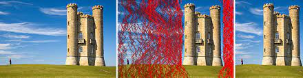

# Seam Carving - Content-Aware Image Resizing

## Problem Statement

Apply the seam carving content-aware image-resizing algorithm to a given image. Take the height and width (in pixels) of the output image as inputs from the user.

### What is Seam Carving?

Seam carving is a content-aware image resizing technique where the image is reduced in size by one pixel of height (or width) at a time.

- A vertical seam in an image is a path of pixels connected from the top to the bottom with one pixel in each row.


Original Image


## Implementation Details

OpenCV is used to extract RGB values of each pixel and to generate images back from RGB values.

### How to Install OpenCV?

Follow the steps below to install OpenCV on your system:

```bash
sudo apt install build-essential cmake git libgtk2.0-dev pkg-config libavcodec-dev libavformat-dev libswscale-dev
sudo apt install libjpeg-dev libpng-dev libtiff-dev libjpeg8-dev libjpeg-turbo8-dev libtiff5-dev libjasper-dev libdc1394-22-dev libgstreamer-plugins-base1.0-dev libavresample-dev
sudo apt install python3-dev python3-pip python3-numpy
git clone https://github.com/opencv/opencv.git
cd opencv
mkdir build
cd build
cmake -D CMAKE_BUILD_TYPE=Release -D CMAKE_INSTALL_PREFIX=/usr/local ..
make -j$(nproc)
sudo make install

```

You should now be able to include <opencv2/opencv.hpp> in your code.